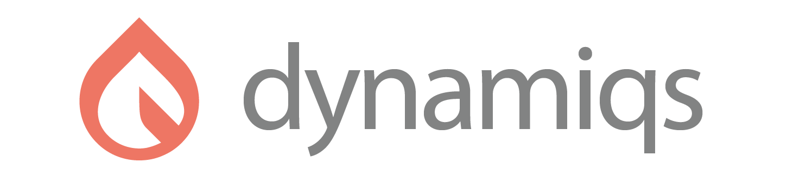

Quantum systems simulation with PyTorch.

This library provides differentiable solvers for the Schrödinger Equation, the Lindblad Master Equation and the Stochastic Master Equation. All the solvers are implemented using PyTorch and can run on GPUs.

:hammer_and_wrench: This library is under active development and while the APIs and solvers are still finding their footing, we're working hard to make it worth the wait. Check back soon for the grand opening!

## Installation

:construction: WIP

## Usage

:construction: WIP

## Performance

:construction: WIP

## Contributing

All contributions are welcome, please see [CONTRIBUTING.md](CONTRIBUTING.md) for further instructions.
